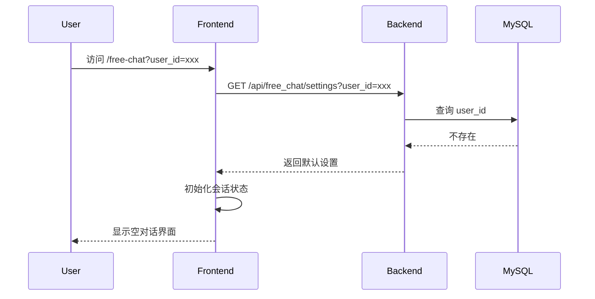
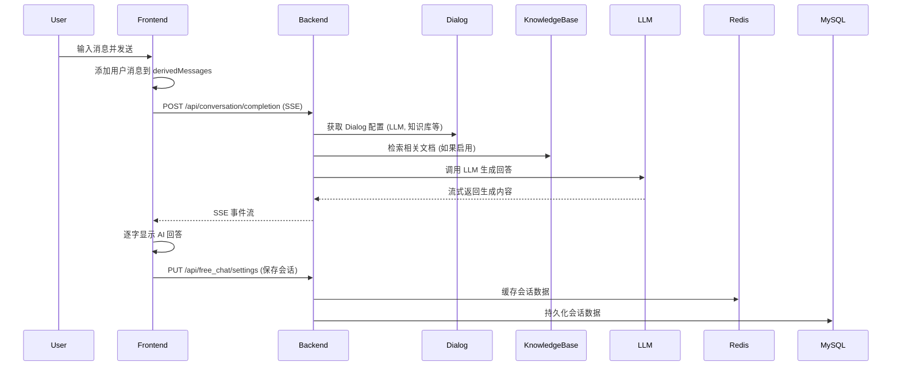
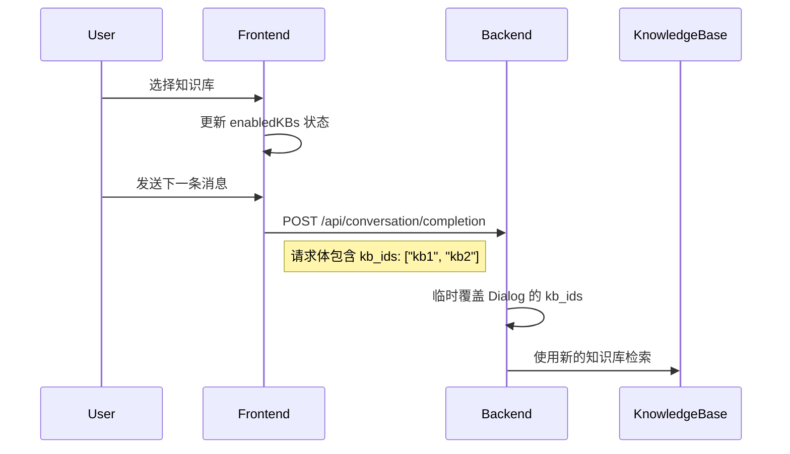

# FreeChat 功能完整分析

> RAGFlow FreeChat 是一个灵活的对话系统,支持动态参数调整和知识库选择
> 
> 分析时间: 2025-01-10
> 基于版本: v0.20.5

## 文档结构

本文件夹包含 FreeChat 功能的完整分析文档:

1. **[README.md](README.md)** (本文件) - 概览和索引
2. **[01-architecture.md](01-architecture.md)** - 架构设计详解
3. **[02-backend-api.md](02-backend-api.md)** - 后端 API 实现
4. **[03-frontend-implementation.md](03-frontend-implementation.md)** - 前端实现细节
5. **[04-usage-guide.md](04-usage-guide.md)** - 使用指南和最佳实践

## 什么是 FreeChat?

FreeChat 是 RAGFlow 的高级对话功能,提供更灵活的对话体验:

### 核心特性

1. **动态模型参数调整**
   - 实时修改 temperature, top_p, frequency_penalty 等参数
   - 每条消息可使用不同的参数配置
   - 无需重新创建对话

2. **动态知识库选择**
   - 对话过程中随时切换知识库
   - 支持多选知识库
   - 可完全不使用知识库

3. **多会话管理**
   - 创建和管理多个独立的对话会话
   - 会话间数据隔离
   - 支持会话重命名和删除

4. **灵活的 Bot 配置**
   - 选择不同的 Dialog (Bot) 进行对话
   - 切换 Bot 时可选择是否创建新会话
   - 支持自定义角色提示词

5. **完整的对话历史**
   - 自动保存对话上下文
   - 支持会话恢复
   - 对话数据持久化存储

## 与传统 Chat 的区别

| 特性 | 传统 Chat (/next-chat/:id) | FreeChat (/free-chat) |
|------|---------------------------|----------------------|
| Bot 选择 | 固定,一个 Dialog 一个页面 | 灵活,可随时切换 |
| 参数调整 | 固定,需修改 Dialog 配置 | 动态,实时调整 |
| 知识库 | 固定,使用 Dialog 配置 | 动态,可随时切换 |
| 会话管理 | 单会话 | 多会话 |
| 使用场景 | 专用 Bot (客服、写作助手等) | 通用对话、实验性对话 |

## 快速开始

### 访问方式

**方法一: 从 next-chats 跳转**
1. 访问 `/next-chats` (Chat Apps 页面)
2. 点击任意 Bot 卡片
3. 自动跳转到 `/free-chat` 并加载该 Bot

**方法二: 直接访问 (需要 user_id 参数)**
```
/free-chat?user_id=<your_user_id>
```

**方法三: 嵌入模式 (iframe)**
```html
<iframe 
  src="https://your-ragflow.com/free-chat?user_id=xxx&auth=<beta_token>&dialog_id=xxx"
  width="100%" 
  height="800px"
></iframe>
```

### URL 参数说明

| 参数 | 必需 | 说明 | 示例 |
|------|------|------|------|
| `user_id` | 是 | 外部用户 ID (任意字符串) | `user123` |
| `auth` | 否 | Beta Token (iframe 模式必需) | `ragflow-xxxx` |
| `dialog_id` | 否 | 初始 Dialog ID | `abc123` |
| `conversation_id` | 否 | 加载已有对话 | `conv456` |
| `language` | 否 | 界面语言 | `zhcn`, `en`, `zhtw` |

## 技术架构概览

### 三层架构

```
┌─────────────────────────────────────────┐
│         前端 (React + TypeScript)        │
│  - 会话管理 (use-free-chat-session.ts)  │
│  - 对话逻辑 (use-free-chat.ts)           │
│  - UI 组件 (ChatInterface, ControlPanel)│
└─────────────────────────────────────────┘
                    ↓ HTTP + SSE
┌─────────────────────────────────────────┐
│         后端 API (Flask + Python)        │
│  - 设置管理 (/api/free_chat/settings)   │
│  - Token 管理 (/api/free_chat/admin_token)│
│  - 对话 API (/api/conversation/completion)│
└─────────────────────────────────────────┘
                    ↓ SQL
┌─────────────────────────────────────────┐
│         数据层 (MySQL + Redis)           │
│  - free_chat_user_settings (MySQL)      │
│  - freechat:sessions:* (Redis L1 缓存)  │
└─────────────────────────────────────────┘
```

### 数据存储

**MySQL 表**: `free_chat_user_settings`
```sql
CREATE TABLE free_chat_user_settings (
  user_id VARCHAR(255) PRIMARY KEY,
  dialog_id VARCHAR(32),
  model_params JSON,
  kb_ids JSON,
  role_prompt LONGTEXT,
  sessions JSON
);
```

**Redis 缓存**: 
- Key: `freechat:sessions:<user_id>`
- TTL: 7 天
- 用途: L1 缓存,加速会话读取

**LocalStorage** (前端):
- `free_chat_dialog_id`: 当前选中的 Dialog ID
- 其他会话数据由后端管理

## 核心流程

### 1. 用户首次访问



### 2. 发送消息



### 3. 切换知识库



## 权限和安全

### 访问控制

FreeChat 使用基于团队的访问控制:

1. **团队成员验证**:
   - 只有同一团队的用户可以访问 user_id 的数据
   - 通过 Dialog 的 tenant_id 验证团队归属

2. **认证方式**:
   - **Session 认证**: 登录用户通过 Flask-Login
   - **API Key 认证**: 外部应用通过 API Key
   - **Beta Token 认证**: iframe 嵌入模式通过 Beta Token

3. **ADMIN_EMAIL 机制**:
   - 配置 `ADMIN_EMAIL` 环境变量
   - 该用户及其团队成员可访问 FreeChat
   - 其他用户访问被拒绝

### Beta Token

Beta Token 用于 iframe 嵌入:

```python
# 生成格式: ragflow-<32位UUID>
beta_token = "ragflow-" + get_uuid()[:32]
```

**获取方式**:
```bash
GET /api/free_chat/admin_token
Authorization: Bearer <access_token>

# 返回:
{
  "token": "ragflow-xxxx",  # Beta Token
  "beta": "ragflow-xxxx",
  "api_key": "real-api-key"
}
```

**使用方式**:
```
/free-chat?user_id=xxx&auth=ragflow-xxxx
```

## 性能优化

### 两级缓存架构

```
用户请求
    ↓
┌─────────────┐
│ Redis (L1)  │ ← 快速读取 (7天TTL)
└─────────────┘
    ↓ (缓存未命中)
┌─────────────┐
│ MySQL (L2)  │ ← 持久化存储
└─────────────┘
```

**L1 (Redis)**: 
- 读取速度: <1ms
- 用于会话数据的快速访问
- 自动过期,减少内存占用

**L2 (MySQL)**:
- 保证数据持久性
- 缓存失效时回源
- 写入时同步更新 L1

### 防抖保存

前端使用 5 秒防抖保存会话数据:

```typescript
const debouncedSave = useMemo(
  () => lodash.debounce(saveSettings, 5000),
  [saveSettings]
);
```

**优势**:
- 减少 API 调用频率
- 避免高频写入数据库
- 提升用户体验 (无感保存)

## 常见问题

### Q1: user_id 从哪里来?

**A**: user_id 是外部用户标识,可以是:
- 企业内部用户 ID
- 邮箱地址
- 第三方账号 ID
- 任意字符串 (建议唯一)

### Q2: 为什么需要 Dialog?

**A**: Dialog 提供必要的配置:
- LLM 模型选择
- 租户信息 (权限和计费)
- 系统提示词 (Bot 人格)
- 默认知识库和检索配置

### Q3: 动态参数如何生效?

**A**: 请求时临时覆盖 Dialog 默认值:
```python
# 后端 conversation_app.py
kb_ids = req.get("kb_ids", [])  # 从请求提取
if kb_ids:
    dialog.kb_ids = kb_ids  # 临时覆盖
```

### Q4: 会话数据会丢失吗?

**A**: 不会,采用多重保障:
- Redis 缓存 (7天)
- MySQL 持久化
- 前端状态管理
- 定期自动保存

### Q5: 可以同时使用多个知识库吗?

**A**: 可以,右侧面板支持多选:
- 检索时会搜索所有选中的知识库
- 结果会合并和重排序
- 可随时切换组合

## 未来规划

- [ ] 对话导出 (JSON/Markdown)
- [ ] 对话分享链接
- [ ] 参数预设模板
- [ ] 知识库组合预设
- [ ] Bot 使用统计和分析
- [ ] 对话收藏和标签
- [ ] 多语言对话 (自动翻译)
- [ ] 语音输入和输出
- [ ] 图片上传和识别
- [ ] 文件上传和解析

## 相关文档

- [架构设计详解](01-architecture.md)
- [后端 API 实现](02-backend-api.md)
- [前端实现细节](03-frontend-implementation.md)
- [使用指南和最佳实践](04-usage-guide.md)

---

**下一步**: 阅读 [架构设计详解](01-architecture.md) 了解详细的技术架构
